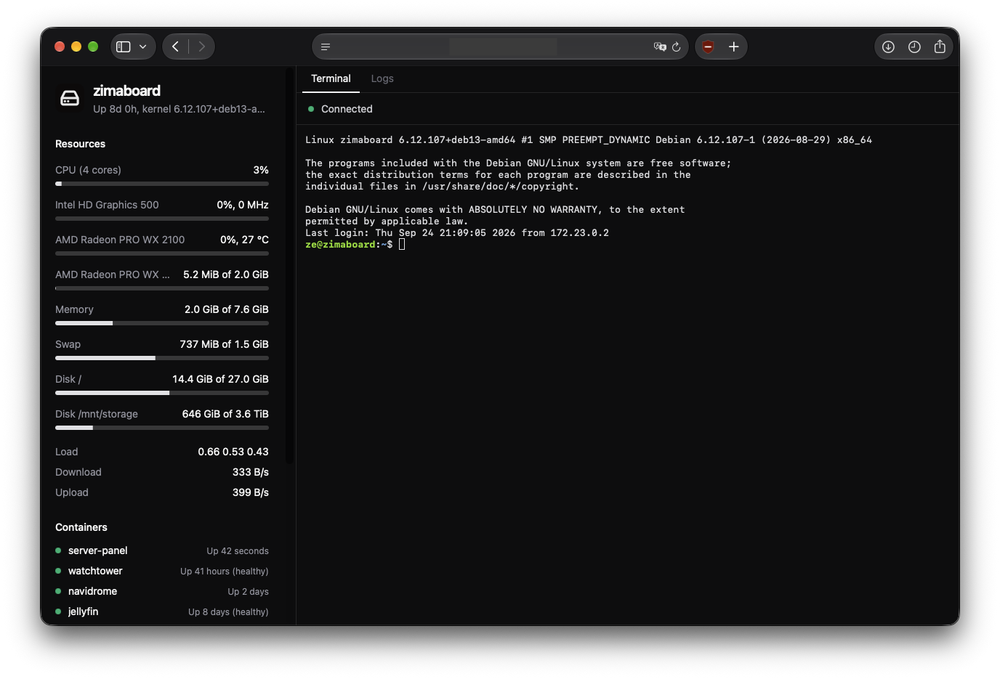

<p align="center">
  
</p>

<h1 align="center">Server panel</h1>

A self-hosted web panel for a Linux server, with two sides:

- **Left:** live stats (CPU, GPU, memory, swap, disks, load, network, containers) and restart and shut down buttons.
- **Right:** a live SSH terminal and a log viewer for the systemd journal and Docker containers.



The app runs in Docker and reaches the server over SSH. It needs a Linux server with systemd; Docker is optional and only needed for the container list and container logs.

> **The app has no login of its own.** Anyone who can open it gets a shell on your server. Only expose it behind an authenticating proxy, such as Cloudflare Access, Authelia, or a VPN.

## Run locally

1. Create a key for your machine and authorize it on the server:

   ```sh
   ssh-keygen -t ed25519 -N '' -C server-panel-dev -f ~/.ssh/server_panel_dev
   ssh-copy-id -i ~/.ssh/server_panel_dev.pub youruser@SERVER_IP
   ```

   To use an existing key that has a passphrase, set `SSH_KEY_PASSPHRASE` in `.env`.

2. On the server, get the host key fingerprint:

   ```sh
   ssh-keygen -lf /etc/ssh/ssh_host_ed25519_key.pub | awk '{print $2}'
   ```

3. Create the env file and fill in the local section:

   ```sh
   cp .env.example .env
   ```

4. Start it:

   ```sh
   bun install
   bun run dev                  # http://localhost:5173, hot reload
   # or
   docker compose up --build    # http://localhost:3010, production build
   ```

## Host it

Every push to `main` publishes `ghcr.io/<owner>/<repo>:latest` through GitHub Actions. The server only needs `compose.yaml`, `.env` and an SSH key.

```sh
mkdir -p ~/server-panel/secrets && cd ~/server-panel
curl -fsSLO https://raw.githubusercontent.com/OWNER/REPO/main/compose.yaml
curl -fsSL https://raw.githubusercontent.com/OWNER/REPO/main/.env.example -o .env

# 1. Key for the container, accepted only from Docker networks
ssh-keygen -t ed25519 -N '' -C server-panel -f secrets/ssh_key
sudo chown 1000:1000 secrets/ssh_key && chmod 600 secrets/ssh_key
echo "from=\"172.16.0.0/12\",no-agent-forwarding,no-port-forwarding,no-X11-forwarding $(cat secrets/ssh_key.pub)" >> ~/.ssh/authorized_keys

# 2. Passwordless reboot/poweroff only
echo "$USER ALL=(root) NOPASSWD: /usr/bin/systemctl reboot, /usr/bin/systemctl poweroff" \
  | sudo tee /etc/sudoers.d/server-panel && sudo chmod 440 /etc/sudoers.d/server-panel

# 3. Read the journal and Docker (log out and back in afterwards)
sudo usermod -aG docker,systemd-journal $USER

# 4. Fill in the server section of .env, then start
docker compose pull && docker compose up -d --no-build
```

To update, run the last line again.

If the package is private, run `docker login ghcr.io` first, using a GitHub token with the `read:packages` scope. Or make the package public under your GitHub profile → Packages → Package settings.

The app listens on `127.0.0.1:3010` (set `PANEL_PORT` to change it). Put your authenticating proxy in front of it and set `ORIGIN` to the public URL, for example `https://panel.example.com`.

## Troubleshooting

- **`ORIGIN` must match the URL in the browser.** Locally that's `http://localhost:3010`, not 127.0.0.1. Otherwise the power buttons and the terminal are rejected.
- **"Could not reach the server over SSH":** check the output of `bun run dev` or `docker compose logs panel`.
  - `ECONNREFUSED` or a timeout: wrong host or port, or a firewall is blocking port 22 from Docker.
  - `All configured authentication methods failed`: the key isn't in the user's `~/.ssh/authorized_keys`.
  - `Encrypted private OpenSSH key detected`: set `SSH_KEY_PASSPHRASE`.
  - `host key mismatch`: `SSH_HOST_KEY_SHA256` must be the ed25519 fingerprint from step 2.
- **GPU busy % missing on Intel:** the driver doesn't expose RC6 residency, so the bar shows the current clock speed instead.
- **If your proxy runs in Docker:** remove `ports:` from `compose.yaml` and put both containers on a shared network.
